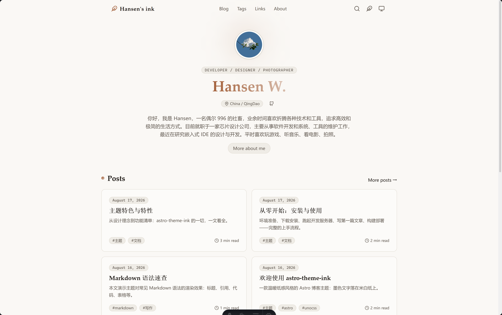
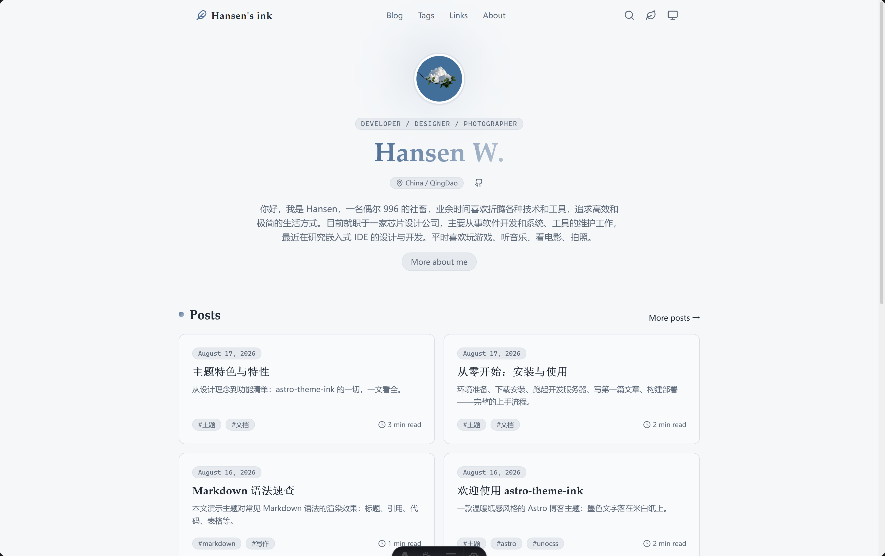
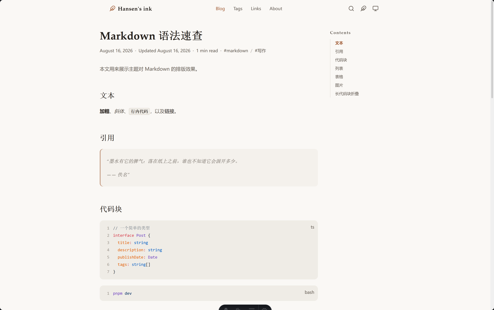
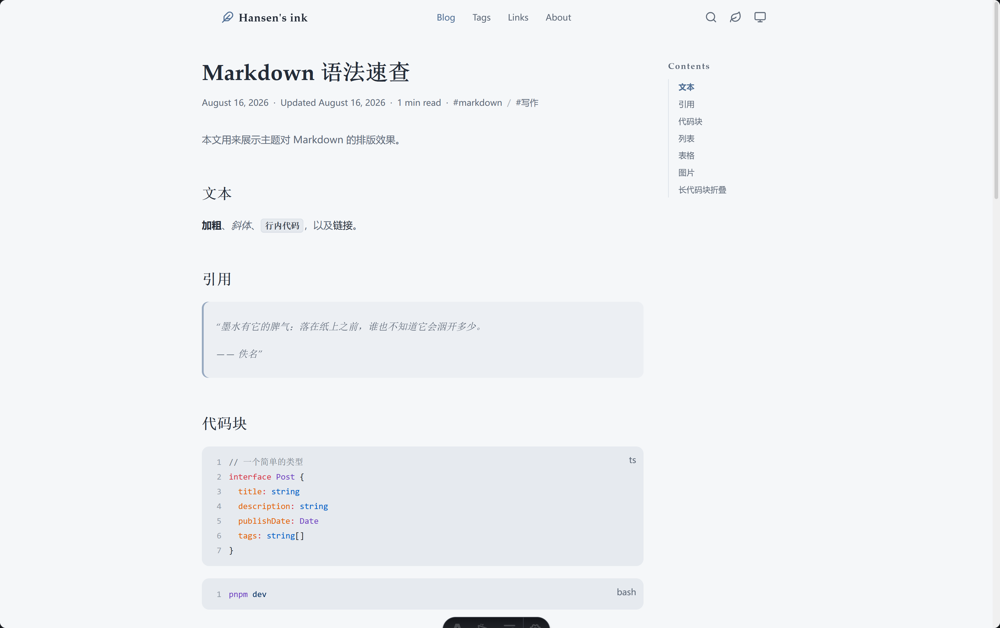
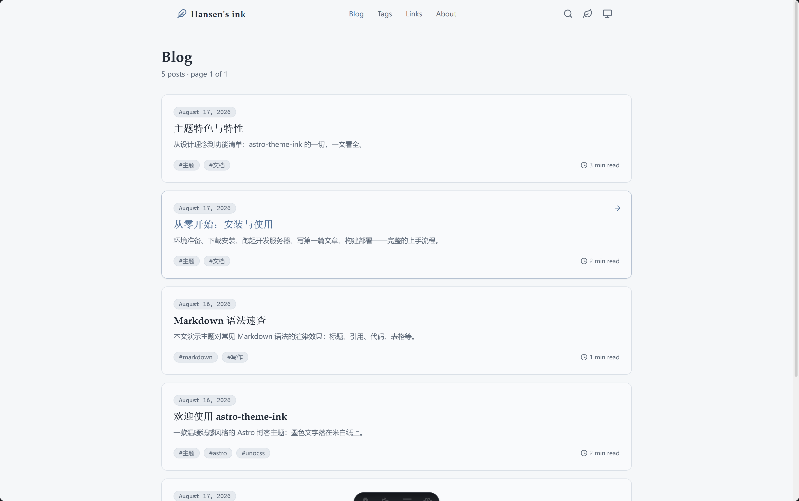
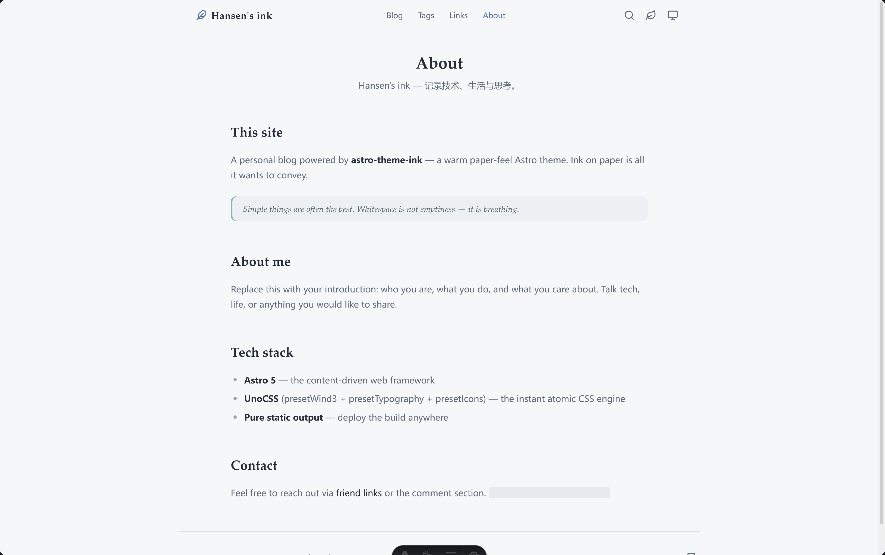
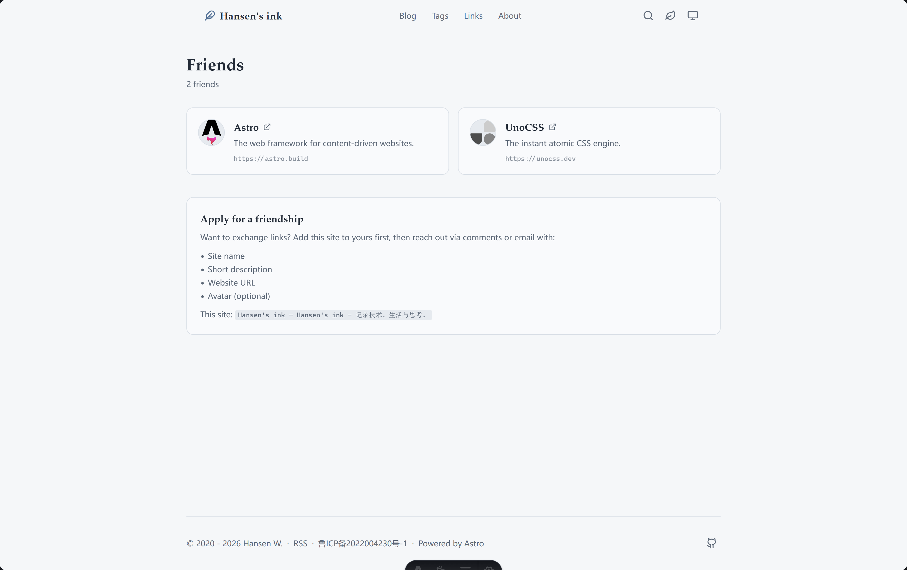

# astro-theme-ink 墨

[English](./README.md) · [简体中文](./README.zh-CN.md)

一款温暖纸感风格的个人博客主题，基于 [Astro](https://astro.build) 与 [UnoCSS](https://unocss.dev) 构建。墨色文字，落在米白纸上——单一强调色、克制的灰阶、充裕的留白、衬线标题。

## 截图预览

<p>
  
  
</p>

<p>
  
  
</p>

<p>
  
  
  
</p>

## 功能特性

- 📝 博客列表：分页、标签、年度归档、RSS 与 sitemap
- 🔍 内置轻量全文搜索——预渲染的 JSON 索引，零外部服务
- 💬 Waline 评论 + 📊 文章阅读量（共用同一 Waline 服务器，在 `src/site.config.ts` 中按需开启）
- 🧮 页脚全站访问量统计——复用同一 Waline 服务器，零额外依赖
- 🌗 亮色 / 暗色 / 跟随系统三种主题，首帧绘制前生效（无闪烁），带平滑过渡
- 🎨 两套内置配色——暖调 **ink** 与雾霾蓝 **fresh**——顶栏一键切换（持久化保存）；柔和的极光渐变与随配色变化的强调色
- 📖 桌面端吸顶目录，移动端可折叠目录
- 🖼️ 每篇文章可选封面图（`heroImage`）
- 📊 文章页阅读进度条 + 上一篇 / 下一篇导航
- 🔍 SEO：JSON-LD `BlogPosting` 结构化数据、Open Graph / Twitter 卡片、canonical URL
- ✍️ 基于 UnoCSS `presetTypography` 的衬线标题排版
- 📦 代码块：语言徽标、复制按钮、暗色模式正确的高亮配色
- 🧩 UnoCSS `presetWind3` + `presetIcons`（lucide），纯静态输出

## 快速开始

```bash
pnpm install
pnpm dev          # http://localhost:4321
```

构建与预览：

```bash
pnpm build
pnpm preview
```

## 写作指南

在 `src/content/blog/` 下新建 Markdown 文件：

```markdown
---
title: '文章标题'
description: '一句话摘要'
publishDate: 2026-08-16
updatedDate: 2026-08-16 # 可选
heroImage: # 可选——相对本文件的本地图片，构建时自动优化
  src: ../../assets/cover.png
  alt: '封面描述'
tags: [标签一, 标签二]
draft: false # 可选，为 true 时不在列表中显示
comment: true # 可选，单篇文章的评论开关
---

正文内容。
```

## 配置

所有配置都集中在 [`src/site.config.ts`](./src/site.config.ts)：

| 配置项          | 作用                                                                                     |
| --------------- | ---------------------------------------------------------------------------------------- |
| `site`          | 站点标题、作者、头像、描述、语言、favicon、OG 卡片                                       |
| `header.menu`   | 导航链接                                                                                 |
| `footer`        | 版权信息、附加链接、社交图标                                                             |
| `home`          | **配置驱动的首页**——hero、文章数、教育经历、技能、标签 / 友链开关                        |
| `blog.pageSize` | 每页文章数                                                                               |
| `search.enabled`| 搜索页与索引开关                                                                         |
| `comment`       | Waline 服务器地址——留空即禁用                                                           |
| `friends`       | 友链，渲染在 `/links` 页面（可选地也渲染在首页）                                          |

### 配置驱动的首页

首页的各个分区由 [`src/site.config.ts`](./src/site.config.ts) → `home` 自动渲染：

```ts
home: {
  hero: {
    tagline: 'Developer / Designer / Photographer', // 名字上方的标签
    location: 'China / QingDao',                    // 位置标签
    about: '关于自己的一段话…',
    buttons: [{ title: 'More about me', link: '/about' }]
  },
  recentPosts: 5,        // 0 表示隐藏该分区
  education: [{ school: '…', major: '…', degree: '…', date: '…' }],
  skills: [{ title: 'Program', items: ['Python', 'Java'] }],
  showTags: false,       // 可选：标签云
  showFriends: false     // 可选：友链
}
```

改配置即可——分区出现 / 消失，无需改动任何组件。

## 外观定制

- 设计令牌（颜色、圆角、字体）：[`src/assets/styles/tokens.css`](./src/assets/styles/tokens.css)
- UnoCSS 主题映射与排版：[`uno.config.ts`](./uno.config.ts)
- 全局样式（代码块、动效、滚动条）：[`src/assets/styles/global.css`](./src/assets/styles/global.css)

## 项目结构

```
src/
├── site.config.ts        # 全部主题配置
├── content.config.ts     # 博客内容集合 schema
├── assets/styles/        # 设计令牌 + 全局样式
├── components/           # Header、Footer、PostCard、Pagination、TOC、Comment
├── layouts/              # BaseLayout、PostLayout
├── pages/                # index、blog、tags、archives、links、about、search、rss、404
├── utils/                # 辅助函数 + 服务端集合工具
└── content/blog/         # 你的文章（Markdown）
```

## 部署

`pnpm build` 生成 `dist/` 纯静态站点——可部署到任意平台（GitHub Pages、Vercel、Netlify、Cloudflare Pages…）。

**上线之前：** 在 [`astro.config.ts`](./astro.config.ts) 中将 `site` 设置为你的真实域名——sitemap、canonical 链接和 RSS 都依赖它。

**性能：** 建议部署到带全球 CDN 和自动压缩的平台——Vercel、Netlify、Cloudflare Pages 默认启用 Brotli/gzip 和图片 CDN，无需额外配置即可获得这些优化。

## 致谢与许可

设计灵感来自 [astro-theme-pure](https://github.com/cworld1/astro-theme-pure)（Apache-2.0）——同为 Astro 生态，独立实现。Shiki 代码块管线（`src/plugins/shiki-custom-transformers.ts`、`src/plugins/shiki-official/`、`public/icons/code.svg`）移植自 astro-theme-pure（Apache-2.0）。基于 [MIT](./LICENSE) 许可发布。
